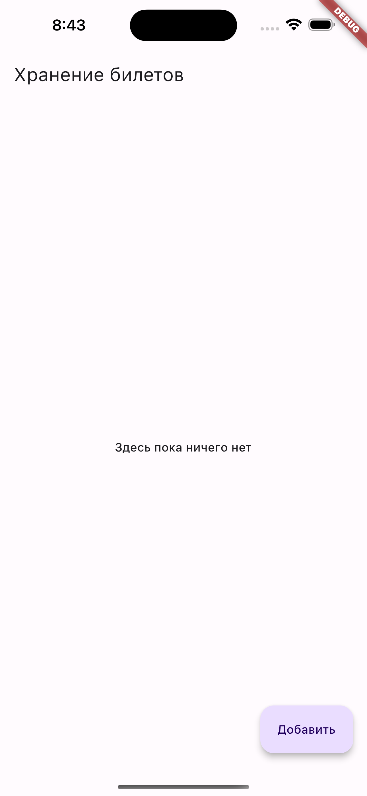
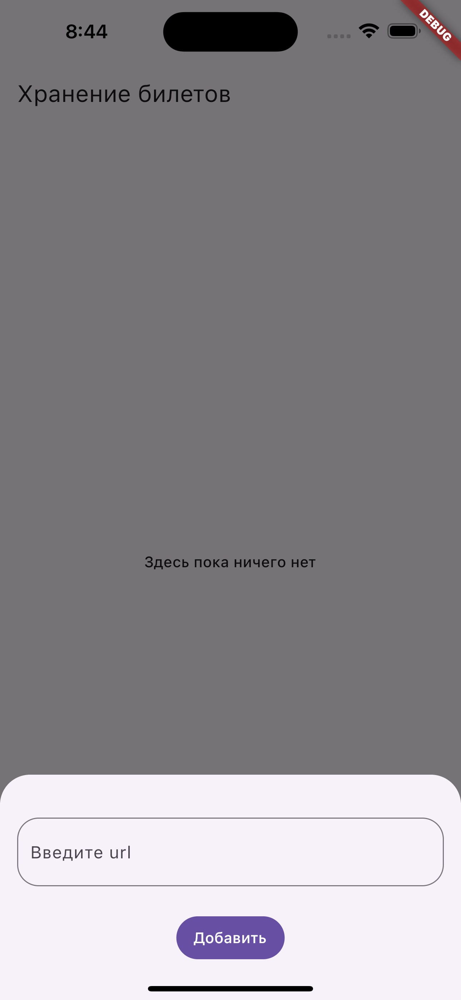
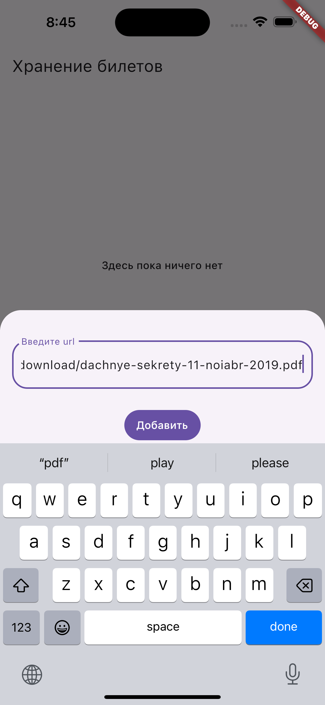
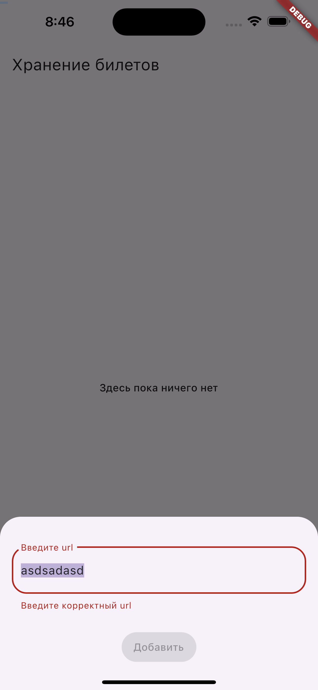
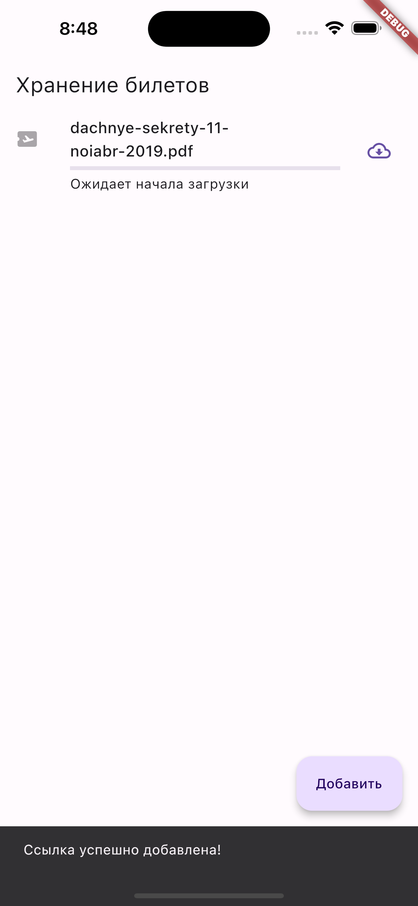
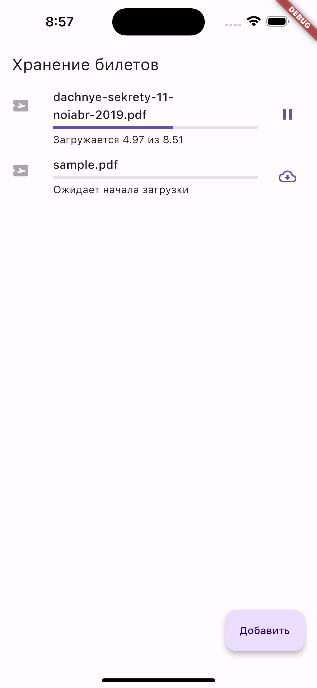
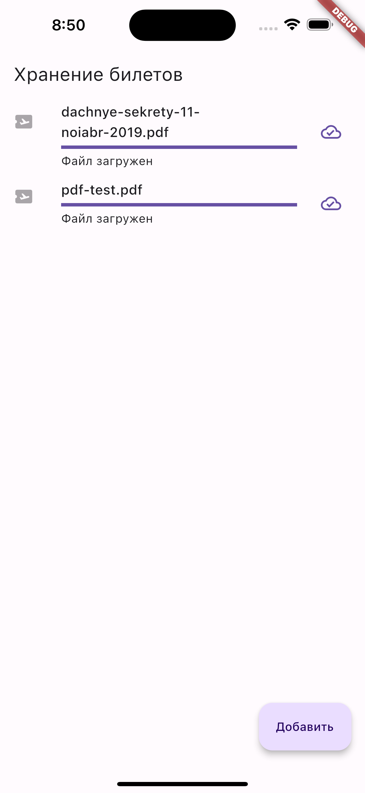

# Целевая платформа

Запускал и отлаживал приложение на iOS и Android.

Спасибо за отличное мероприятие, было очень полезно и интересно 🚀

# Результаты

### Задание 1

Релизован интерфейс экрана: Аппбар, состояния экрана, модальное окно (или боттомшит), кнопки, карточка файла.

### Задание 2

Реализована логика добавления ссылки на загрузку файла. Введенные данные валидируются.

Реализовано отображение снекбара при успешном добавлении ссылки.

### Задание 3

Реализована логика отображения списка файлов.

### Задание 4

Релизованы:

- Загрузка файла.
- Индикатор прогресса загрузки файла.
- Индикатор прогресса загрузки в Мбайтах: текущее значение и общий вес файла.
- Возможность поставить загрузку на паузу. Затем ее возобновить.

# Ссылки на демонстрацию работы/скриншоты

### Главный экран - состояние отсутствия данных

### Добавление данных

### Отображение данных

